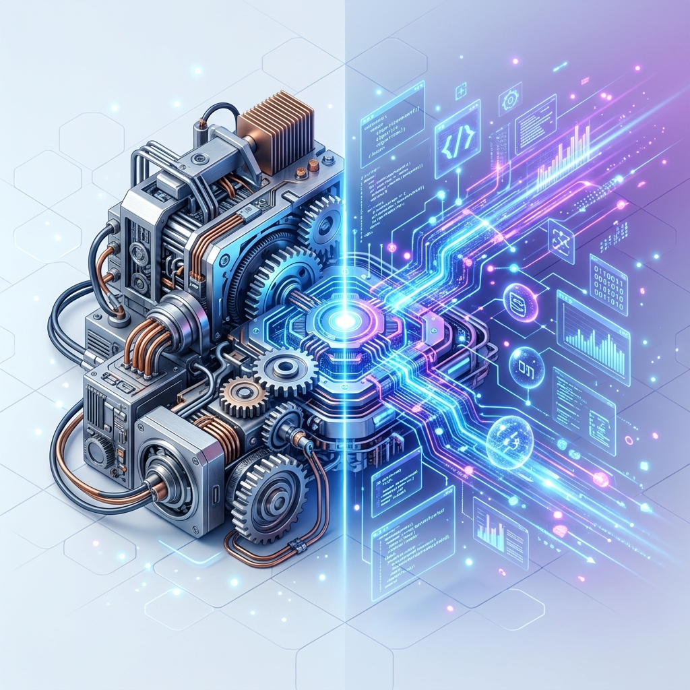

## 🎯 El Reto

Imagina que quieres preparar la mejor pizza del mundo para tus amigos. Tienes una cocina increíble: un horno de piedra, una amasadora eléctrica, cuchillos muy afilados y una mesa de mármol amplia. Pero hay un gran problema: **no tienes ninguna receta**. No sabes cuánto tiempo calentar el horno ni en qué orden poner los ingredientes. Los utensilios están ahí, pero no hacen nada por sí solos.

Por otro lado, imagínate que tienes la receta secreta de la mejor pizzería de Italia escrita en un papel, pero **no tienes cocina**. Tienes el conocimiento, pero no tienes donde aplicarlo. **¿Qué es lo más importante para que la pizza sea una realidad?** 

> "La tecnología es solo una herramienta. En términos de conseguir que los niños trabajen juntos y motivarlos, el profesor es lo más importante". — Bill Gates.

La respuesta es que ambos necesitan trabajar juntos. En el mundo de la tecnología, esto es exactamente lo que sucede con el Hardware y el Software. Sin uno, el otro no tiene sentido. El reto de hoy es que aprendas a distinguir las piezas de tu equipo y cómo cuidarlas para que tu "cocina digital" siempre funcione al cien por ciento(6).

## 💡 ¿Cómo funciona esto?

### 1. Hardware: El Cuerpo de la Máquina
Para entender cómo se divide el trabajo en tu equipo, piensa en el **Hardware** como todo lo físico, lo que puedes tocar y sentir con tus manos. Son los "músculos" y las herramientas pesadas de tu equipo que permiten realizar el trabajo(1). 

> "El hardware es lo que puedes golpear; el software es lo que solo puedes maldecir". — Atribuido a Stewart Brand.

Dentro de este grupo encontramos piezas clave:
- **El Cerebro (Procesador o CPU)**: Es como el chef de la cocina que ejecuta todas las órdenes y cálculos lógicos. Es el corazón de la máquina.
- **La Mesa de Trabajo (Memoria RAM)**: Es el espacio donde picas los ingredientes. Si la mesa es muy pequeña, te tardas más porque tienes que estar quitando cosas para poner otras. Si abres muchas pestañas de Internet y tu equipo se pone lento, es porque tu "mesa" de RAM está llena(2).
- **La Alacena (Disco Duro o SSD)**: Es donde guardas todos los ingredientes y recetas para usarlos después(4). Aunque apagues la computadora, todo lo que está aquí se queda guardado de forma permanente.

### 2. Software: La Mente Digital
El **Software** es la parte inteligente que no puedes tocar. Son las instrucciones que le dicen al hardware qué debe hacer. Sin el software, el hardware es solo un objeto de metal y plástico sin vida(6).

> "El software es una combinación de arte e ingeniería". — Bill Gates.

Existen dos tipos principales que debes conocer:
- **El Sistema Operativo**: Es como el reglamento de la cocina que dice quién usa qué herramienta y en qué momento. Su función es gestionar las reglas del hardware para que todo funcione en orden (ejemplo: Windows, Android, iOS)(5).
- **Las Aplicaciones**: Son programas diseñados para tareas específicas, como editar una foto, escribir una tarea o navegar por la web(3).

> "Cualquier tecnología lo suficientemente avanzada es indistinguible de la magia". — Arthur C. Clarke.

> [!TIP]
> **Cuidado Integral**: El hardware necesita limpieza física y buena ventilación para no "quemarse". El software necesita actualizaciones constantes para no volverse lento o inseguro. ¡Cuida ambos!

## ✍️ Manos a la obra

Identifica si estos elementos de tu vida digital son herramientas físicas (Hardware) o programas inteligentes (Software):

| Elemento | ¿Hardware o Software? | ¿Qué función cumple en tu equipo? |
| :--- | :--- | :--- |
| **Monitor o Pantalla** | Hardware. | Te muestra visualmente todo lo que está pasando(1). |
| **Navegador (Chrome/Edge)** | Software. | Es la aplicación que usas para entrar a Internet(3). |
| **Ratón (Mouse)** | Hardware. | Te permite señalar y elegir opciones con la mano. |
| **Instagram / TikTok** | Software. | Son programas diseñados para ver videos y fotos(3). |
| **Teclado** | Hardware. | Tu herramienta principal para escribir información. |
| **Procesador (CPU)** | Hardware. | El cerebro que hace todos los cálculos rápidos. |
| **Antivirus** | Software. | El programa que protege tu equipo de amenazas. |
| **Memoria USB** | Hardware. | Una pequeña "alacena" portátil para llevar archivos(4). |

## 🌍 En tu mundo

Casi todo lo que usas hoy usa este sistema. Tu celular tiene una pantalla y batería (Hardware) y un sistema como Android que permite que uses tus apps (Software). Incluso un horno de microondas tiene botones físicos y un pequeño programa que sabe cuánto tiempo calentar tus palomitas.

Entender esto te ayuda a saber qué falla cuando algo no funciona. Si la pantalla está rota, es un problema de Hardware. Si el juego no abre, es un problema de Software. Al conocer tu equipo, dejas de tenerle miedo a la tecnología(1).

## 🏁 Pausa para pensar

1. Si tuvieras que elegir una sola pieza de Hardware para mejorar de tu equipo, ¿cuál elegirías y para qué te serviría?
2. ¿Qué programa o Software es el que más te ayuda en tus tareas de la escuela?
3. ¿Cómo le explicarías a tu abuelito la diferencia entre el aparato (Hardware) y lo que ves dentro (Software)?
4. Si tu computadora fuera una persona, ¿quién sería el Hardware y quién el Software?

## 📚 Glosario Maestro

- **Hardware**: Todo lo físico que puedes tocar en un dispositivo electrónico(1).
- **Software**: El conjunto de programas e instrucciones que hacen que el equipo funcione(6).
- **Memoria RAM**: Espacio de trabajo temporal donde el equipo procesa lo que estás usando ahora(2).
- **Disco Duro/SSD**: Lugar donde se guarda la información de forma permanente (fotos, tareas)(4).
- **CPU**: Unidad Central de Procesamiento; el "cerebro" que ejecuta las órdenes.

## 🌟 Zona de Descubrimiento

- **Dato curioso 1**: Los primeros "hardwares" de computación eran tan grandes que ocupaban habitaciones enteras y pesaban toneladas. ¡Hoy caben en la palma de tu mano!
- **Dato curioso 2**: El término "Bug" (bicho) para referirse a un error de software nació porque una polilla real se metió en una computadora antigua y la descompuso.
- **Para ver**: *Intensamente* (Disney). Aunque habla de emociones, es una gran analogía: las islas de memoria son el hardware y los pensamientos son el software que corre en ellas.
- **Para explorar**: Abre la configuración de tu celular y busca "Información del dispositivo". Verás cuánta RAM y almacenamiento tiene tu equipo real.
- **Para conversar**: Pregúntale a un adulto: "¿Cuál fue la primera computadora que usaste y cómo era su hardware comparado con el de ahora?".

## 🏆 Reto Final

1. Si estás trabajando en una tarea y de repente se apaga la luz, ¿dónde se pierde la información que no habías guardado todavía?
   - A) En el Disco Duro o SSD (Alacena).
   - B) En la Memoria RAM (Mesa de trabajo).
   - C) En el monitor o pantalla.
   - D) En el teclado o mouse.

2. ¿Cuál es la función principal del Procesador (CPU) dentro de una computadora?
   - A) Guardar las fotos y videos de forma permanente.
   - B) Ejecutar todas las órdenes y cálculos como el "cerebro" del equipo.
   - C) Mostrar las imágenes con colores brillantes en la pantalla.
   - D) Limpiar el polvo de las piezas internas automáticamente.

3. Un navegador de Internet, un juego o un programa para escribir son ejemplos de:
   - A) Hardware especializado de alta gama.
   - B) Software de aplicación diseñado para tareas específicas.
   - C) Componentes internos del monitor de la computadora.
   - D) Sistemas de ventilación para el procesador.

4. ¿Qué componente de Hardware es el encargado de guardar tus archivos (fotos, tareas) incluso cuando apagas el equipo?
   - A) El Procesador (CPU).
   - B) La Memoria RAM.
   - C) El Disco Duro o la unidad SSD.
   - D) El Sistema Operativo.

5. El Sistema Operativo (como Windows, Android o iOS) tiene como tarea principal:
   - A) Dibujar y editar imágenes de forma profesional.
   - B) Gestionar los recursos del hardware para que todas las aplicaciones funcionen en orden.
   - C) Conectarse a la luz eléctrica sin necesidad de cables.
   - D) Limpiar la pantalla táctil de huellas dactilares.

6. Si una computadora tiene el hardware perfecto pero no tiene instalado ningún tipo de Software, ¿qué puede hacer?
   - A) Solo puede navegar en redes sociales de forma lenta.
   - B) Nada; es como una cocina increíble pero sin chef ni recetas que den órdenes.
   - C) Solo puede proyectar luz blanca a través del monitor.
   - D) Puede guardar archivos pero no permite verlos.

## 🔑 Respuestas Correctas

1. B | 2. B | 3. B | 4. C | 5. B | 6. B
