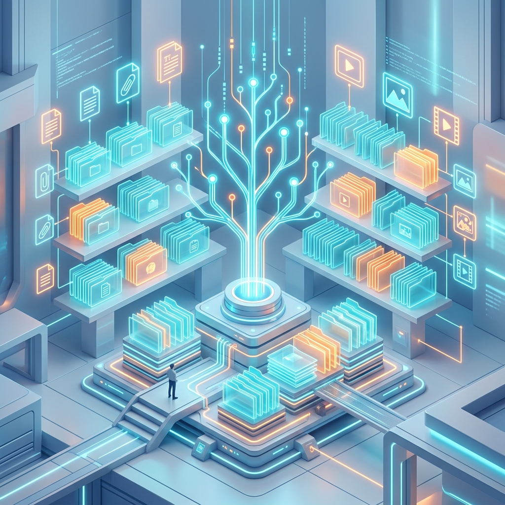

## 🎯 El Reto

Imagina que tienes una colección de 500 fotos, 20 canciones y 30 documentos de la escuela, pero **todo está guardado en una sola carpeta llamada "Varios"**. Si mañana tu profesor te pide la tarea que entregaste hace dos meses, **¿cuánto tiempo tardarías en encontrarla?** 

En el mundo digital, ser organizado es la diferencia entre terminar rápido y relajarte, o pasar horas buscando un archivo que "jurabas que estaba aquí". Organizar tu computadora es como organizar tu mochila escolar: si sabes exactamente dónde está cada cuaderno y cada pluma, todo fluye mejor.

> "El orden es la clave de la libertad". — Desconocido.

El reto de hoy es que aprendas a dominar el arte de la organización digital para que nunca vuelvas a perder un trabajo importante. Vamos a convertir tu "mochila digital" en un sistema perfecto donde encuentres todo en menos de 10 segundos.

## 💡 ¿Cómo funciona esto?

### 1. La Dirección Digital (El Árbol de Carpetas)
Para que nada se te pierda, el sistema operativo utiliza una **Estructura de Árbol**. Imagina un árbol donde cada parte tiene un nivel diferente:
- **Las Raíces (Unidades)**: Es el lugar principal donde vive todo, como el Disco Local (C:).
- **El Tronco (Carpetas Principales)**: Son las carpetas base, como "Documentos" o "Imágenes".
- **Las Ramas (Subcarpetas)**: Son carpetas guardadas dentro de otras carpetas para separar los temas (ejemplo: `Documentos > Escuela > Computación`)(6).
- **Las Hojas (Archivos)**: Son tus trabajos, fotos o canciones reales.

### 2. El Nombre del Archivo
Cada archivo tiene un nombre y una **extensión** que le dice a la computadora qué tipo de información tiene. Por ejemplo, si termina en **.pdf**, es un documento que se verá igual en cualquier dispositivo(1). Para mantener el orden, siempre debes usar nombres que describan el contenido(5). Evita nombres como "tarea_final_finalísima.docx".

> "Una buena organización es como un mapa: te ahorra tiempo y esfuerzo". — Desconocido.

### 3. Tus Herramientas de Limpieza
El sistema te da tres herramientas vitales:
- **Papelera de Reciclaje**: Si borras algo por error, se queda aquí un tiempo para que lo puedas recuperar(2).
- **Compresión (Archivos ZIP)**: Sirve para "apretar" tus archivos y que pesen menos, facilitando mucho su envío por Internet(4).
- **Buscador (Lupa)**: Es la forma más rápida de encontrar algo cuando olvidaste en qué carpeta lo guardaste(3).

> "Organizar es lo que haces antes de hacer algo, para que cuando lo hagas, no sea un caos". — A.A. Milne.

> [!TIP]
> **La Prueba del Tiempo**: Si tardas más de 10 segundos en encontrar un archivo, tu organización falló. Intenta crear subcarpetas por año y por materia para que tu búsqueda sea inmediata.

## ✍️ Manos a la obra

Aplica acciones inteligentes para mantener tu "mochila digital" en perfecto orden:

| Situación problemática | Acción de mejora | Herramienta del sistema |
| :--- | :--- | :--- |
| **Tienes 10 tareas de diferentes materias mezcladas.** | Crear carpetas con el nombre de cada materia. | Nueva Carpeta. |
| **Borraste una foto por error hace un minuto.** | Buscar en el depósito temporal de borrados. | Papelera de Reciclaje(2). |
| **Tu archivo de video pesa mucho para enviarlo.** | "Apretar" el archivo para reducir su tamaño. | Comprimir en .ZIP(4). |
| **El archivo se llama "AAAAA.docx" y no sabes qué es.** | Poner un nombre claro (ej. "Tarea_Historia"). | Cambiar nombre (F2)(5). |
| **Buscas una tarea de enero pero no la ves.** | Escribir el nombre en el cuadro de búsqueda. | Buscador / Lupa(3). |
| **Quieres separar tus fotos por meses.** | Crear carpetas como "Enero", "Febrero", etc. | Nueva Carpeta(6). |
| **Te pasaron un documento que no puedes editar.** | Abrirlo con un visor de documentos universales. | Archivo .PDF(1). |
| **Tu escritorio está lleno de iconos estorbando.** | Mover los archivos a la carpeta de Documentos. | Cortar y Pegar. |

## 🌍 En tu mundo

Tu vida diaria ya usa sistemas de archivos. Tienes un lugar para la ropa limpia, otro para los trastes de la cocina y otro para tus cuadernos. En la computadora, trasladar este orden te hará sentir más tranquilo y seguro de tu trabajo(5). Ser una persona organizada digitalmente es una de las habilidades que más valoran las empresas y escuelas hoy en día.

## 🏁 Pausa para pensar

1. ¿Cómo se ve tu "Escritorio" de la computadora ahora mismo? ¿Refleja orden o caos?
2. ¿Qué ventaja tiene usar nombres claros en lugar de nombres cortos como "1" o "a"?
3. ¿Cuál es el archivo más valioso que tienes guardado y qué harías si lo perdieras hoy?
4. Si tuvieras que organizar tu cuarto usando la lógica de "Carpetas y Archivos", ¿cómo lo harías?

## 📚 Glosario Maestro

- **Archivo**: La unidad básica de información (foto, canción, tarea).
- **Carpeta**: Contenedor virtual para organizar archivos y otras carpetas.
- **Extensión**: Las letras al final del nombre (.jpg, .pdf) que dicen qué tipo de archivo es(1).
- **Subcarpeta**: Una carpeta que vive dentro de otra para subdividir información(6).
- **Papelera**: Almacén temporal de archivos borrados que permite recuperarlos(2).

## 🌟 Zona de Descubrimiento

- **Dato curioso 1**: Antes de las memorias USB, la gente usaba "Disquetes" que solo podían guardar el equivalente a una sola foto de mala calidad. ¡Eran muy frágiles!
- **Dato curioso 2**: El icono de la carpeta de Windows es de color amarillo porque está inspirado en los folders de papel que se usaban antiguamente en las oficinas.
- **Para ver**: *Toy Story*. Imagina que cada juguete es un archivo y el cuarto de Andy es el disco duro. El orden de los juguetes permite que la historia fluya.
- **Para explorar**: Abre una carpeta cualquiera y presiona la tecla `F2` sobre un archivo. ¡Es el atajo más rápido para cambiarle el nombre!
- **Para conversar**: Pregúntale a un adulto: "¿Cómo guardaban sus archivos antes de que existieran las computadoras o el Internet?".

## 🏆 Reto Final

1. Si encuentras un archivo que termina con la extensión ".pdf", ¿qué es lo más seguro que contenga?
   - A) Una canción que se puede escuchar y bailar.
   - B) Un documento de lectura que se ve igual en cualquier equipo(1).
   - C) Un virus peligroso que va a descomponer el monitor.
   - D) Un video de alta resolución con efectos especiales.

2. ¿Qué sucede realmente si seleccionas un archivo y lo arrastras a la Papelera de Reciclaje?
   - A) Se borra de forma permanente y ya no hay forma de recuperarlo.
   - B) Se mueve a un almacén temporal por si te arrepientes y quieres recuperarlo(2).
   - C) Se crea una copia de seguridad en Internet automáticamente.
   - D) El archivo cambia de nombre por una serie de números aleatorios.

3. ¿Cuál es la forma más rápida de encontrar un archivo si no recuerdas en qué carpeta lo guardaste?
   - A) Abrir todas las carpetas del disco duro una por una hasta verlo.
   - B) Usar la barra de búsqueda (icono de lupa) y escribir una palabra del nombre(3).
   - C) Apagar el equipo y prenderlo para que el sistema lo encuentre solo.
   - D) Volver a crear el archivo desde cero para no perder el tiempo.

4. ¿Para qué sirve comprimir archivos (crear un archivo .zip o .rar)?
   - A) Para que el dibujo del icono se vea más pequeño y elegante.
   - B) Para reducir el tamaño del archivo y que sea más fácil enviarlo por Internet(4).
   - C) Para que el archivo no pueda ser visto por ninguna otra persona.
   - D) Para cambiar automáticamente el formato de un video a un texto.

5. Según las buenas reglas de orden, ¿cómo debe ser el nombre de un archivo digital?
   - A) Muy corto y con números para ahorrar espacio en la memoria.
   - B) Descriptivo y claro para saber qué contiene sin necesidad de abrirlo(5).
   - C) Exactamente el nombre raro que el programa le ponga por defecto.
   - D) El nombre de tu mejor amigo para que sea fácil de recordar.

6. En la organización de una computadora, ¿qué es exactamente una "Subcarpeta"?
   - A) Una carpeta que se encuentra guardada dentro de otra carpeta principal(6).
   - B) Un archivo que está dañado y ya no se puede abrir más.
   - C) El nombre técnico que se le da a la papelera de reciclaje.
   - D) El botón redondo que abre el menú principal del sistema.

## 🔑 Respuestas Correctas

1. B | 2. B | 3. B | 4. B | 5. B | 6. A
